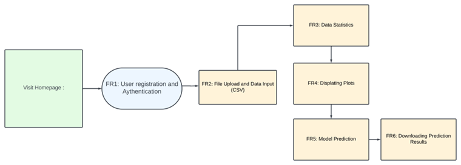

# Predicting-Cancerous-Tumor-Cells-in-Breast-Tissue
In 2023, roughly 2 million people will be diagnosed with some type of cancer in the United States with breast cancer being the most common type of cancer diagnosis (National Cancer Institute, 2018). The primary aim of this project is to build a machine learning data product that can aid in cancer diagnosis from fine needle aspirate data. 
The application can be accessed via the hyperlink provided here “Predicting Cancerous Tumor Cells in Breast Tissue”, additionally since a login page was implemented for security purposes you will be prompted for user-credentials. At the moment, three pre-set credentials have been added to mock the type of healthcare personnel that will be using this data product, the case-sensitive username and passwords are provided below for use of either one:
Username	Password
IT	abc123
rnurse	def456
physician	ghi789

Once you have been granted access please download the hyperlinked CSV file named Example Input File for Application, this is a CSV file that is similar to what the end-user will be uploading into the application. They are features normally extracted from a fine needle aspirate procedure that were used to train the task-specific model that propels the predictive functionality of the application. Once access has been granted and example input file has been downloaded, proceed to interact with the data product by uploading the input file and toggle through the various pages. 
